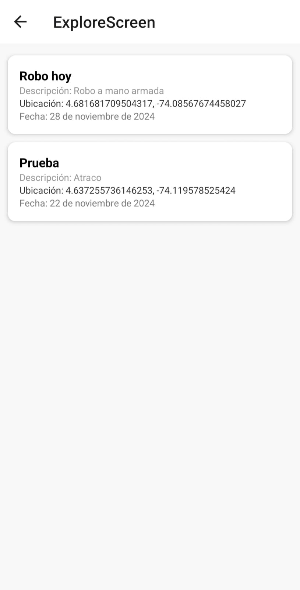

Universidad Konrad Lorenz  

Desarrollo de Aplicaciones Móviles  
**Alertcity**  
Julian Cardenas

 
## Funcionalidades

### Pantallas principales
1. **Login**
   - Autenticación con Firebase utilizando correo electrónico y contraseña.
   - Navegación a la pantalla de registro si el usuario no tiene una cuenta.

2. **Register**
   - Permite al usuario registrarse con su correo electrónico y contraseña.
   - Conexión con Firebase para almacenar credenciales.

3. **Home**
   - Muestra un mapa interactivo con marcadores de alertas obtenidas de Firebase.
   - Incluye un buscador por ubicación y una lista de alertas.
   - Permite navegar a las pantallas de perfil y explorar.

4. **AlertScreen**
   - Creación de nuevas alertas con detalles como tipo, título, subtítulo, descripción, ubicación y fecha.
   - Selección de ubicación en un mapa interactivo.
   - Guarda las alertas en Firebase.

5. **Explore**
   - Lista de alertas con detalles como categoría, descripción, ubicación y fecha.
   - Navegación desde las alertas almacenadas en Firebase.

6. **Profile**
   - Visualización de información del usuario.
   - Permite al usuario cerrar sesión.

### Funcionalidades adicionales
- **Mapa interactivo**:
  - Uso de `react-native-maps` para mostrar alertas y permitir selección de ubicación.
- **Lista de alertas**:
  - Implementación de `FlatList` para mostrar alertas en las pantallas Home y Explore.
- **Firebase**:
  - Base de datos en tiempo real para almacenar y obtener alertas.
  - Autenticación para inicio de sesión y registro.
- **Navegación**:
  - Uso de `@react-navigation/native` y `@react-navigation/stack` para la estructura de navegación entre pantallas.

## Librerías utilizadas

1. **React Native**: Framework base para la aplicación móvil.
2. **@react-navigation/native**: Para la navegación entre pantallas.
3. **@react-navigation/stack**: Configuración del stack de navegación.
4. **react-native-maps**: Mapa interactivo para mostrar y seleccionar ubicaciones.
5. **firebase**:
   - Autenticación para el inicio de sesión y registro de usuarios.
   - Firestore para almacenamiento de alertas.
6. **react-native-vector-icons**: Para los íconos de la interfaz.
7. **react**: Manejo de componentes y estado.

# Capturas de Pantalla

A continuación, se muestran las capturas de pantalla del proyecto:

## Register Screen

## Login Screen

## Home Screen

## Alert Screen

## Explore Screen

## Profile Screen

